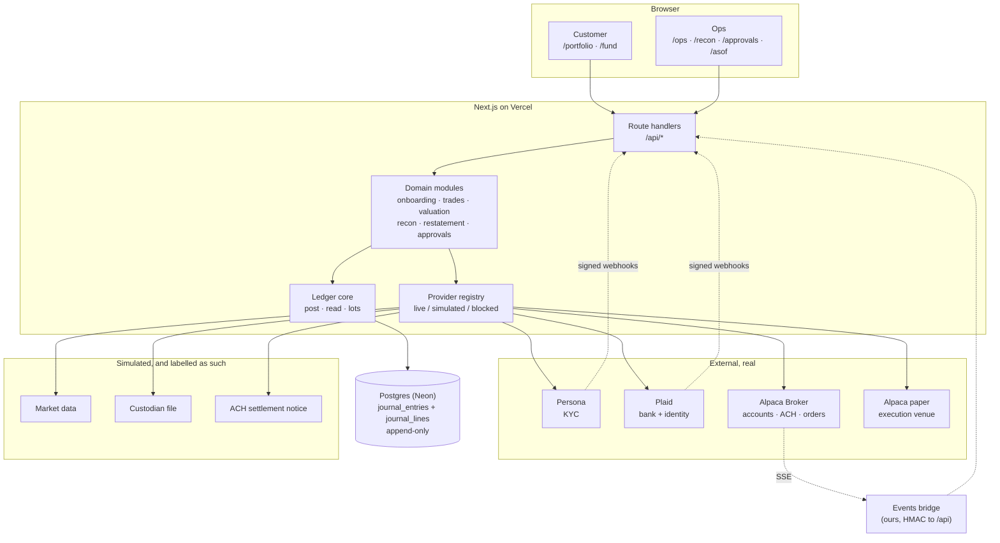
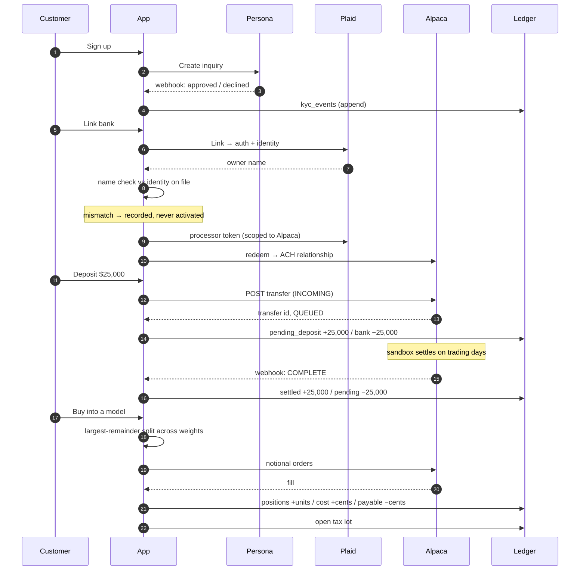

# System design

How Ledgerly is built and why it is built that way. [`DECISIONS.md`](DECISIONS.md)
is the running log of choices as they were made; this is the settled picture.

The one-sentence version: **there is a ledger, and everything else is a fold over
it.** No balance column, no positions table, no status field. If a number can be
derived, it is derived, because a stored number is a number that can disagree
with the journal — and the first thing an auditor does is look for that
disagreement.

---

## 1. The shape of it



Everything that writes money goes through **one function**, `postEntry`, and
everything that reads money goes through folds in `read.ts`. That narrow waist is
what makes the invariants checkable: there is one place to be correct.

---

## 2. Data model

### The core: two tables

```
journal_entries            journal_lines
  id                         id
  kind                       entry_id ──────┐
  effective_at   ← when it     account_code │
  recorded_at    ← when we     customer_id  │  many lines
  narrative        learned     commodity    │  per entry
  source                       amount_cents │  balancing to zero
  created_by                   units        │  per commodity
  reverses_entry_id            related_symbol
  corrects_entry_id
```

Nothing else is authoritative. Positions, cash, cost basis, portfolio value and
the return are all computed from these two tables.

### Chart of accounts

Thirteen accounts, which is the whole vocabulary:

| Account | Holds |
|---|---|
| `assets:cash:settled` | Good funds. Withdrawable. |
| `assets:cash:unsettled_proceeds` | Sale proceeds before T+1. Investable, **not** withdrawable. |
| `assets:cash:pending_deposit` | ACH in flight. Neither, and excluded from portfolio value. |
| `assets:positions` | Units held — instrument commodities only. |
| `assets:positions:cost` | Cost basis in USD, tied to a symbol by `related_symbol`. |
| `assets:receivable:dividend` | Declared, not yet paid. |
| `liabilities:trade_payable` | Owed to the custodian, settles T+1. |
| `liabilities:withdrawal_payable` | Approved money-out not yet on the rail. |
| `income:dividend`, `income:realized_gain` | Where return comes from. |
| `equity:external:bank` | **The customer's bank, from our side.** |
| `equity:external:market` | The counterparty in a trade. |
| `equity:opening_balances` | Migration only. |

The two `equity:external:*` accounts are the trick that makes single-entity
double entry work: money and units have to come from *somewhere*, and these are
the named outside world. `equity:external:bank` is what makes a withdrawal
classify as an external flow; `equity:external:market` is deliberately **not**
that, which is why a split does not move the return.

### Supporting tables

Grouped by what they are for. All of the money-adjacent ones are append-only.

- **Identity and access** — `customers`, `users`, `kyc_events` (an event stream,
  not a status column), `bank_links`
- **Instruments and prices** — `instruments`, `prices` (superseded, never
  updated), `corporate_actions`
- **Trading** — `orders`, `order_events` (status is the latest event),
  `settlements`, `tax_lots`, `tax_lot_consumptions`
- **Models** — `model_portfolios`, `model_versions`, `model_weights`,
  `customer_mandates`
- **Money movement** — `cash_transfers`, `cash_transfer_events`
- **Valuation and reporting** — `valuation_runs`, `valuation_positions`,
  `valuation_totals`, `published_returns`, `return_subperiods`
- **Operations** — `recon_runs`, `recon_breaks`, `approvals`
- **Integration** — `webhook_deliveries`, `webhook_duplicate_deliveries`

A pattern repeats: wherever a thing has a *state*, the state is the latest row of
an event table, not a column. Order status, KYC status, transfer status. The
history is the artefact; the current value is a query.

---

## 3. The three rules the database enforces

These are not conventions. They are triggers and constraints, and
[`/invariants`](https://corgi-assignment.vercel.app/invariants) proves them by
attempting each violation against the production database on page load.

**Units and money never mix.** A line carries `amount_cents` *or* `units`, never
both, decided by its commodity:

```sql
CHECK ((commodity =  'USD') = (amount_cents IS NOT NULL))
CHECK ((commodity <> 'USD') = (units        IS NOT NULL))
```

There is no column anywhere that can hold "value". Market value is `units ×
price`, computed at read time, and therefore always attributable to a specific
price on a specific date.

**Every entry balances to zero, per commodity, independently.** A
`DEFERRABLE INITIALLY DEFERRED` constraint trigger checks at `COMMIT`, so a
two-commodity trade can be written leg by leg but cannot be *committed* half
done.

**Money rows are append-only.** `BEFORE UPDATE OR DELETE` triggers raise
unconditionally on **ten** tables — `journal_entries`, `journal_lines`,
`prices`, `tax_lots`, `tax_lot_consumptions`, `settlements`, `order_events`,
`cash_transfer_events`, `corporate_actions` and `published_returns`. The journal
tables additionally carry a `BEFORE TRUNCATE` **statement** trigger, because
`TRUNCATE` bypasses row-level triggers entirely. That is the gap most people
leave open.

This is not theoretical tidiness. It is why `applyCorrectedClose` had to compute
its figures *before* publishing rather than patching the wording after: an
`UPDATE` on `published_returns` is refused by the table itself. There is no
second chance to correct a published reason, which is the point of the table.

Correction is therefore **reversal and re-book**, never an edit. The wrong entry
stays, a reversing entry cancels it, and the right entry is added — which is what
makes the audit trail worth having.

---

## 4. The money path



Two things in that diagram carry most of the weight.

**The deposit is two entries, not one.** Initiation moves bank → pending;
settlement moves pending → settled. In-flight cash is a first-class ledger
position that is excluded from portfolio value, rather than a spinner in the UI.
This is also what makes the return correct: the *settlement* is the external
flow, because that is the moment the measured portfolio changes.

**The name check happens before the token is minted.** Funding an investment
account from a stranger's bank is how laundering works, so an account belonging
to someone else never becomes a funding source — the attempt is recorded in
`bank_links` with `name_match = false` and no relationship is created.

---

## 5. Reads are folds

One query shape underlies every balance in the system:

```sql
SELECT account_code, commodity, sum(amount_cents), sum(units)
  FROM journal_lines JOIN journal_entries USING (...)
 WHERE effective_at <= :asOf      -- what had HAPPENED by then
   AND recorded_at  <= :knownAt   -- what we KNEW by then
 GROUP BY account_code, commodity
```

Those two predicates answer three different questions people conflate:

| `asOf` | `knownAt` | Question |
|---|---|---|
| now | now | What *is* the balance |
| 3 Sep | now | What was it on 3 Sep, given everything we know now |
| 3 Sep | 3 Sep | What did we **believe** on 3 Sep — the as-published figure |

The third is the one a regulator asks about, and here it is a parameter rather
than a subsystem. [`/asof`](https://corgi-assignment.vercel.app/asof) puts all
three on one screen and lists the late-arriving facts that separate the last two.

**A restatement is not a code path.** It is a later `recorded_at`. The same
function produces the as-published and the as-corrected figure; only the
timestamp differs. That is the entire mechanism, and it only works because
nothing is ever updated in place.

### Derived reads and their homes

| Figure | Module | Notes |
|---|---|---|
| Cash buckets, positions, trial balance | `ledger/read.ts` | The fold above |
| Open tax lots | `ledger/lots.ts` | Excludes lots replaced by a split |
| Daily book value | `valuation.ts` | `units × price`, stale prices flagged |
| Time-weighted return | `returns.ts` + `performance.ts` | Flow rule is pure and tested separately |
| As-published vs as-corrected | `restatement.ts` | Two `knownAt` values, one function |

---

## 6. Where the return comes from, and the trap in it

```
r = (EV − BV − F) / (BV + F)      chained geometrically across days
```

`F` is the external flow, and **defining `F` is where return figures go wrong.**
It went wrong here twice, in opposite directions, before it was right:

- *too narrow* — requiring a line in `settled` **and** a line facing the bank.
  A deposit settling touches no bank account, so deposits were not flows at all,
  and cash arriving read as performance. That showed a demo account **+153.80%**.
- *too broad* — counting the deposit at initiation, which lands the flow a day or
  more before the value it explains.

The rule that survives both: the boundary is **what portfolio value measures**,
not what faces the bank.

```
measured        assets:cash:settled, assets:cash:unsettled_proceeds, positions
outside         equity:external:bank, assets:cash:pending_deposit
```

A flow is value crossing that line. It lives in one pure function, `netFlowByDay`,
decided per entry, with the SQL doing nothing but pre-filtering — ten tests pin
it, including the dividend that must stay *return* and the house line that marks
a withdrawal as a flow while contributing nothing to its amount.

**A 2-for-1 split is the sharpest test of this.** Units double, per-unit basis
halves, and value, total basis and return must not move at all. It works because
the split entry has no USD line, and the new units face `equity:external:market`
rather than the bank — face them at the bank and the return jumps. `npm run
split-test` compares the return at **twelve** decimal places, because two
different returns can print identically at two.

---

## 7. The provider boundary

Every external dependency is declared in one registry
(`src/lib/providers/registry.ts`) with a mode, and the UI badges render from that
same declaration the runtime code reads — so a slot cannot change mode without
its badge changing in the same commit.

```
type ProviderMode = 'live' | 'simulated' | 'blocked'
```

`blocked` exists because of a real finding. Outgoing ACH is genuinely attempted
on every withdrawal and Alpaca genuinely refuses it with `403`. Calling that
"live" would claim money reaches the bank; calling it "simulated" would claim we
invented a transfer. Neither is true, so it has its own mode and its own colour.
The refusal is written verbatim into the journal entry.

That the refusal is about the **direction** rather than the balance was
established by experiment, not inferred:

```
OUTGOING, valid relationship    → 403 forbidden
OUTGOING, UNKNOWN relationship  → 403 forbidden   ← identical, so nothing was read
INCOMING, valid relationship    → 422 "1 per trading day in each direction"
```

### Webhooks

Inbound events arrive by two routes, and it is worth being precise about which:

- **Persona and Plaid sign their own webhooks.** Persona uses
  `HMAC-SHA256(secret, "t.body")`; Plaid sends an ES256 JWT verified against its
  JWKS, *and* the JWT's `request_body_sha256` claim is checked against the raw
  body — verifying the JWT alone would let anyone replay a valid one with a body
  of their choosing.
- **Alpaca does not sign anything.** It exposes three SSE streams, which our own
  **events bridge** consumes and posts inward under a shared-secret HMAC. So the
  signature there attests to *our bridge*, not to Alpaca. Worth saying plainly,
  because a diagram that draws all three as "signed provider webhooks" overstates
  what is cryptographically established.

The pipeline is then the same for both:

1. **Verify the signature first.**
2. **Then claim the idempotency key.** The unique index is *partial* —
   `WHERE signature_valid` — so an unverified delivery cannot occupy the key and
   suppress the real one that follows. An earlier version claimed the key before
   verifying, which was a denial-of-service anyone could trigger.
3. **Record duplicates rather than dropping them silently**, in
   `webhook_duplicate_deliveries`, so "twice is one" is visible on
   [`/webhooks`](https://corgi-assignment.vercel.app/webhooks).

**Order by the provider's event time, not by arrival.** Persona delivered
`inquiry.declined` *before* `inquiry.created` in a real run. Ordering the KYC
history by receipt made the newest event `pending` — softening a hard block to a
soft one, which is a KYC gate failing **open**. An invariant now replays that
exact delivery.

---

## 8. Controls

**Maker-checker, one rule, no branch.** The maker raises it; a **different**
person approves *and* executes it. Money-out enters the queue only above the
threshold, so there is no second band behaving differently.

Enforcement is in the database, not in route code:

```sql
approvals_no_self_approval        decided_by  <> requested_by
approvals_no_self_execution       executed_by <> requested_by
approvals_above_threshold         money-out below the threshold cannot queue
approvals_trigger_cannot_decide   -- and _cannot_execute
  -- both read payload->>'triggeredBy': whoever asked the agent to raise it
  -- is barred from deciding it AND from executing it
```

That last one closes the hole the agent surface would otherwise open. When the
ops console asks an *agent* to raise a request, `requested_by` becomes the agent,
the distinct-identity check is satisfied, and the human who typed the amount
could approve their own request with an agent's name standing in for the second
pair of eyes. Maker-checker would be decorative **and would look enforced**.

**The agent may read anything and propose anything, but may not decide, move, or
erase.** Four MCP tools: three read, one write, and the write creates a *pending
approval* — no journal entry, no transfer, no money. Operations an agent must
never have are **absent from the surface**, not merely guarded: there is no
function to call, every proposal is stamped `requested_by_kind = 'agent'`, the
CHECK constraints refuse self-approval even from `psql`, and the executor refuses
any decider identity prefixed `agent:`.

---

## 9. Things that bite, and how they are handled

| Hazard | Handling |
|---|---|
| **Market dates are New York, timestamps are UTC** | `timestamptz < (date + 1)` compares against UTC midnight and hides everything booked 20:00–23:59 New York — a four-hour blind spot, every evening. One helper (`MARKET_DAY_END_SQL`) defined once; nine call sites. |
| **`now()` is transaction start time** | Two inserts in one transaction share it. Anywhere ordering depends on receipt time, `recorded_at` is set explicitly. |
| **One ACH transfer per Alpaca account per trading day** | Per *account*, so a spent allowance blocks that customer only. `npm run demo-ready` asks Alpaca directly rather than inferring from our records. |
| **One active ACH relationship per account** | Unlink deletes at the broker first, enumerating from **Alpaca** rather than from our rows — an orphan we already deactivated is invisible to our own query and is exactly what blocks relinking. |
| **`sum(bigint)` returns NUMERIC** | Cast back to `bigint` at every fold, so cents never transit a float or a string concat. |
| **Provider state drifts under us** | Never assert it. The sign-in page *reads* KYC status; the smoke test finds whoever is currently gated instead of naming them. |

That last row is the one general rule this system keeps re-learning: **our record
of a provider's state is not the provider's state.** It has appeared as a
fail-open `.catch(() => [])`, as an unlink that trusted our own rows, as a
hardcoded KYC label, and as a test asserting a fixture.

---

## 10. What would change at scale

Honest about what this is: a 48-hour build that is correct rather than fast.

| At 100× | Change |
|---|---|
| Reads | The folds are `O(lines)`. Add a **materialised** daily balance snapshot per customer, rebuilt from the journal and *checked against it* — a cache that is verified, never a source of truth. The invariant becomes "snapshot equals fold". |
| Writes | `postEntry` is one transaction per entry, which is right. Partition `journal_lines` by month once it is large; the queries are already bounded by `effective_at`. |
| Valuation | Currently a run per customer per day. Batch by price date — one price fetch, many customers. |
| Providers | The registry already isolates them. Add a circuit breaker per slot; the kill switch exists, the breaker does not. |
| Webhooks | Verification and journal write happen in one request. At volume, verify + persist, then process from a queue — the idempotency key already makes redelivery safe. |
| Multi-currency | The ledger is *already* multi-commodity, so USD/EUR is the same machinery as USD/VOO. What is missing is FX rates as a priced fact and a reporting-currency choice, not a schema change. |

The thing that would **not** change is the core: append-only, balanced per
commodity, bitemporal, everything derived. That is the part worth being slow and
careful about, and it is the part that makes all of the above safe to add later.
